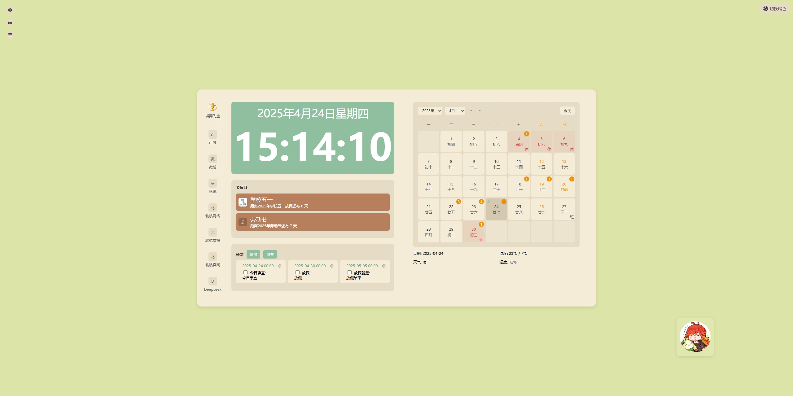
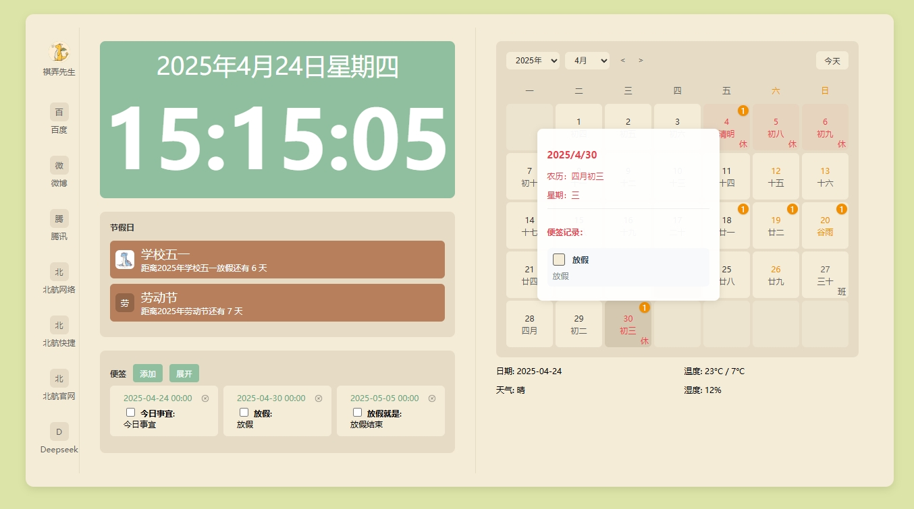

# Chrome 新标签页插件





## 项目概述

这是一个功能丰富的 Chrome 新标签页插件，旨在为用户提供一个美观且实用的浏览体验。该插件集成了时钟、网站导航、日历、便签、节假日倒计时等功能，并添加了富有趣味性的交互元素，帮助用户更好地管理时间和任务。

## 主要功能

### 1. 界面布局
- **左侧导航栏**：快速访问常用网站
- **中间内容区**：显示时钟和便签功能
- **右侧面板**：日历和天气信息
- **右下角**：互动表情图标

### 2. 核心功能
- **实时时钟**：显示当前时间和日期
- **便签系统**：
  - 添加、查看、删除便签
  - 支持标题和内容
  - 自动保存时间戳
  - 展开/收起长列表
  - TODO列表以及完成
- **日历功能**：
  - 显示公历和农历日期
  - 节假日标记
  - 上下月份切换
  - 便签关联日历显示
- **天气信息**：
  - 实时天气状况
  - 温度和湿度显示
- **节假日倒计时**：
  - 显示距离主要节假日的天数
  - 自动更新和排序显示

### 3. 特色功能
- **主题切换**：
  - 支持明暗两种主题
  - 随机背景色切换
- **互动表情**：
  - 右下角可爱表情图标
  - 鼠标悬停显示每日趣味文案
  - 点击切换表情状态
  - 根据星期几显示不同心情文案

### 4. 文案系统
每天都有不同的趣味文案，根据工作日和周末显示不同内容：
- **周一至周五**：职场生活相关的幽默文案
- **周末**：轻松愉快的休闲文案
- 每个时段随机显示多条文案之一

## 技术栈

**核心框架**  
- Chrome Extension MV3 架构
- JavaScript ES6+（模块化开发）

**特色功能实现**  
- 节气算法：基于《寿星天文历》改进的24节气计算模块  
- 自适应布局：CSS Grid + Flexbox 混合布局方案  
- 农历转换：Chinese Lunar 库二次开发（支持节气计算）
- 天气接口：QWeather API 分钟级缓存机制

**性能优化**  
- 虚拟化便签列表渲染  
- CSS Containment 优化  
- IndexedDB 本地缓存

## 安装指南

### 快速安装（小白用户）
1. 下载[最新发布包](https://example.com/latest.zip)
2. 解压到固定目录（建议路径：`C:/Extensions/NewTab`）
3. 打开 Chrome → 访问 `chrome://extensions`
4. 启用右上角 **开发者模式**
5. 点击 **加载已解压的扩展程序** 选择解压目录

### 开发者安装
```bash
git clone https://github.com/wangrongguo/chrome-rongo-new-tab.git
cd chrome-rongo-new-tab && npm install
npm run build
# 生成 dist/ 目录用于加载
```

**常见问题**  
❗ 若出现"无效的manifest"：  
- 确认 Chrome 版本 ≥ 88  
- 检查网络连接（需要访问QWeather API）  
- 禁用其他新标签页扩展

## 使用指南

### 基本操作
1. **便签功能**：
   - 点击"添加便签"创建新便签
   - 填写标题和内容
   - 点击便签右上角删除按钮删除
   - 超过三条时可展开/收起

2. **主题切换**：
   - 点击右上角主题按钮切换明暗主题
   - 每次切换随机更换背景色

3. **互动表情**：
   - 鼠标悬停查看每日文案
   - 点击切换表情状态
   - 每次刷新随机显示不同文案

### 自定义设置
- 可在 `manifest.json` 中修改插件配置
- 在 `js/main.js` 中可自定义文案内容
- 在 `css/style.css` 中可调整界面样式

## 更新日志

### v1.4.0（2025-04-20）
- 新增本地文件修改存储功能：
  - 支持对便签内容进行本地文件存储，确保数据在浏览器关闭后不丢失。
  - 实现文件修改监听，当本地文件被修改时，自动同步到插件界面。
  - 提供手动保存和自动保存两种模式，自动保存间隔可配置。
- 界面优化：
  - 新增保存状态提示，让用户清楚知道数据是否已保存。
  - 调整便签编辑区域样式，提升输入体验。
- 性能优化：
  - 对本地文件读写操作进行异步处理，避免阻塞主线程。
  - 增加文件操作缓存机制，减少不必要的文件读写。

### v1.3.0（2024-06-20）
- 新增自定义节假日功能：
  - 支持JSON格式配置文件
  - 农历/公历双模式支持
  - 智能日期冲突检测
  - 前端验证配置格式
- 界面优化：
  - 日历项间距调整（8px → 12px）
  - 新增节假日期动画效果
  - 优化移动端触控响应区域
- 操作优化：
  - 无感新增便签同步日历

### v1.2.0（2024-03-20）
- 节气算法重构：
  - 采用《寿星天文历》计算模型
  - 支持公元前722年至公元2200年
  - 精度±0.5天
- 自适应布局升级：
  - 基于CSS Grid + Flexbox混合布局
  - 新增断点：320px/768px/1024px
  - 使用CSS Containment优化渲染性能
- 高频词统计：
  - 基于TF-IDF算法
  - 支持便签内容实时分析
- 修复日历切换时农历计算异常问题

### v1.1.0（2024-02-15）
- 表情互动系统：
  - SVG路径动画实现
  - 状态机管理表情切换
  - 基于localStorage的状态持久化
- 文案系统升级：
  - 内置200+条UGC文案
  - 基于工作日/节假日的动态过滤
  - 支持Markdown格式渲染
- 便签性能优化：
  - 虚拟滚动技术（100+条流畅展示）
  - IndexedDB本地缓存
  - 防抖自动保存（500ms间隔）
- 主题切换动画：
  - CSS Transition实现
  - 支持HSL色彩空间过渡

### v1.0.0
- 初始版本发布
- 实现基础功能

## 开发指南

### 环境配置
1. Node.js 18.x + npm 9.x
2. VS Code 推荐安装插件：
   - Chrome Extension Toolkit
   - ESLint
   - Stylelint

### 二次开发
```bash
# 启动开发服务器
npm run dev 
# 实时监听样式变化
npm run watch:styles
# 构建生产版本
npm run build
```

## 贡献指南  
欢迎提交包含以下内容的PR：
- 完善节气算法（/src/utils/solarterm.js）
- 优化响应式断点设置（/src/styles/_breakpoints.scss）
- 新增天气预警组件

## 许可证  
本项目采用 MIT 许可证，保留所有图标的设计版权。

## 项目目录结构
```
demo008/
├── css/               # 样式文件
│   ├── calendar.css   # 日历组件样式
│   └── style.css     # 全局样式
├── js/                # 脚本文件
│   ├── calendar.js    # 日历核心逻辑
│   └── main.js       # 入口文件
├── lib/               # 第三方库
│   └── chinese-lunar.min.js  # 农历转换库
├── images/            # 图片资源
├── holidays.json      # 自定义节假日配置
└── manifest.json      # Chrome插件配置
```

## 节假日配置说明
1. 编辑`holidays.json`文件
2. 按格式添加条目：
```json
{
  "name": "节日名称",
  "type": "lunar/solar",  // 农历/公历
  "month": 数字月份,
  "day": 日期,
  "description": "描述"
}
```
3. 支持同时配置生日提醒（参考现有示例）

## 插件部署步骤
1. 访问 `chrome://extensions`
2. 启用右上角「开发者模式」
3. 点击「加载已解压的扩展程序」
4. 选择本项目的根目录
5. 打开新标签页即可体验

## 已知问题
| 问题现象 | 解决方案 |
|---------|---------|
| 首次加载农历数据较慢 | 允许浏览器完成IndexedDB初始化 |
| 极端日期格式兼容性问题 | 使用YYYY-MM-DD标准格式 |
| 3D模型加载失败 | 检查网络连接和模型文件路径 |
